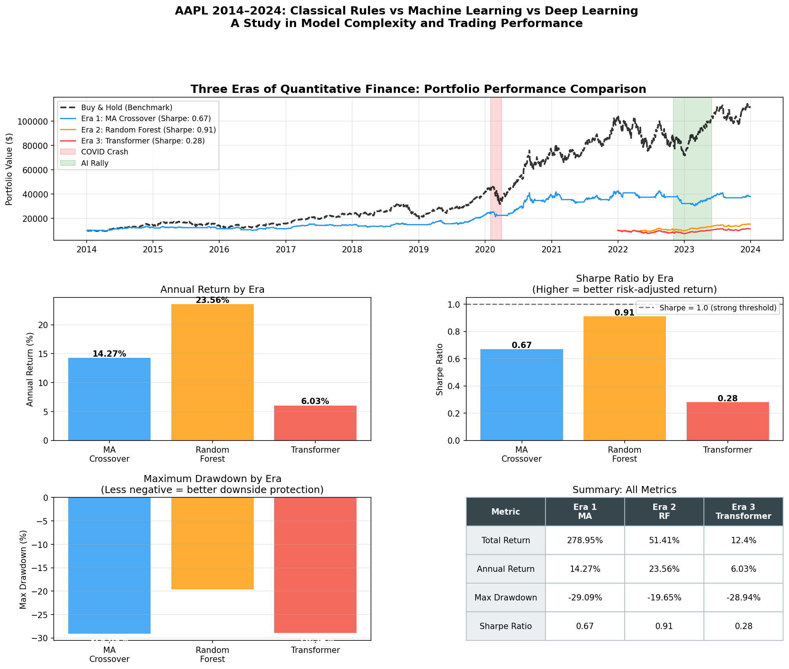

# Three Eras of Quantitative Finance
### Rule-Based Strategies vs Classical ML vs Deep Learning
### A Comparative Study on 10 Years of AAPL Market Data (2014–2024)



---

## Overview

This project investigates how quantitative trading strategies have evolved 
across three distinct eras, applied to 10 years of real AAPL market data.

**Central Question:**
> Does increasing model complexity lead to better trading performance?

**Short Answer:** Not necessarily — and understanding *why* is more 
valuable than the answer itself.

This project was built as a two-week independent research study to explore 
the intersection of modern AI and quantitative finance, from 1970s rule-based 
systems to Transformer-based deep learning models used in today's top 
quantitative firms.

---

## The Three Eras

| Era | Method | Core Idea | Sharpe Ratio | Annual Return | Max Drawdown |
|-----|--------|-----------|-------------|---------------|--------------|
| Era 1 | MA Crossover | Human-written rules based on moving averages | 0.67 | 14.27% | -29.09% |
| Era 2 | Random Forest | Machine learns patterns from historical features | 0.91 | 23.56% | -19.65% |
| Era 3 | Transformer | Self-attention over 60-day return sequences | 0.28 | 6.03% | -28.94% |

---

## Key Findings

### Finding 1: Complexity Does Not Guarantee Performance
The Random Forest (Era 2) achieved the highest Sharpe Ratio among the 
three strategies, outperforming the significantly more complex Transformer. 
This aligns with recent literature — PatchTST (2023) demonstrated that 
well-designed simpler models can match or exceed deep learning on financial 
time series tasks.

### Finding 2: The Naive Prediction Trap
When first trained to predict raw prices, the Transformer achieved 
near-zero training loss and appeared to perform perfectly. However, 
closer inspection revealed it had learned a degenerate strategy: 
predicting tomorrow's price ≈ today's price.

This is a well-known but under-discussed pitfall in financial ML. 
We exposed it by comparing model predictions against a naive baseline 
(yesterday's price), then fixed it by switching the task from price 
prediction to return direction prediction.

### Finding 3: Evaluation Period Matters
A direct comparison of total returns across eras is misleading:
- Era 1 covers 2014–2024, capturing AAPL's strongest bull market
- Era 3 only covers 2022–2024, a high-volatility post-peak period

This highlights a fundamental challenge in strategy evaluation: 
results are highly sensitive to the chosen time window, and naive 
comparisons can produce misleading conclusions.

### Finding 4: Buy & Hold as a Surprisingly Strong Benchmark
On a strongly trending asset like AAPL, all three strategies 
underperform a simple Buy & Hold over the full period. This suggests 
that for trend-following assets in bull markets, timing the market 
consistently is harder than staying invested — a result consistent 
with the efficient market hypothesis.

---

## The Discovery Process

One of the most valuable aspects of this project was the iterative 
research process itself. The Transformer's naive prediction trap was 
not anticipated — it was discovered through careful analysis of 
suspiciously good results, and then systematically diagnosed and fixed.

This mirrors real research workflows: results that look too good 
often warrant deeper investigation.

---

## Project Structure
```
quant-ai-project/
├── data/
├── notebooks/
│   ├── 01_data_exploration.ipynb      # Data download and EDA
│   ├── 02_era1_rule_based.ipynb       # MA Crossover and RSI strategies
│   ├── 03_era2_ml.ipynb               # Random Forest with feature engineering
│   ├── 04_era3_transformer.ipynb      # Transformer (incl. naive trap discovery)
│   ├── 05_final_comparison.ipynb      # Full comparison and visualization
│   └── 06_event_analysis.ipynb        # Model behavior during key market events
├── results/
│   ├── 01_price_performance.png
│   ├── 02_return_distributions.png
│   ├── 03_era1_rule_based.png
│   ├── 04_feature_importance.png
│   ├── 05_era2_rf_performance.png
│   ├── 06a_loss_v1_prices.png
│   ├── 06b_naive_prediction_trap.png
│   ├── 06c_loss_comparison.png
│   ├── 07_transformer_prediction.png
│   ├── 08_era3_performance.png
│   ├── 11_final_comparison.png
│   ├── 12_event_covid_crash.png
│   ├── 13_event_covid_recovery.png
│   ├── 14_event_rate_hike.png
│   └── 15_event_summary.png
└── README.md
```
## How to Reproduce

```bash
# Install dependencies
pip install yfinance pandas numpy matplotlib scikit-learn torch

# Launch Jupyter
jupyter notebook

# Run notebooks in order: 01 → 02 → 03 → 04 → 05
```

All data is downloaded automatically via yfinance — no manual 
data download required.

---

## Technical Stack

| Component | Tool |
|-----------|------|
| Data | yfinance (Yahoo Finance API) |
| Classical ML | scikit-learn RandomForestClassifier |
| Deep Learning | PyTorch Transformer |
| Backtesting | Custom framework (see notebooks/02) |
| Visualization | matplotlib |

---

## Key Concepts Demonstrated

- **Lookahead Bias**: why random train/test splits are invalid for time series
- **Naive Prediction Trap**: how near-zero loss can indicate model failure
- **Overfitting vs Regime Change**: the limits of pattern-learning in non-stationary markets
- **Sharpe Ratio**: why raw returns alone are insufficient for strategy evaluation
- **Ensemble Learning**: how Random Forest aggregates 200 decision trees via Bootstrap Sampling

---

## Author

Independent research project — Summer 2025  
École Polytechnique, Mathematics & Economics (Double Major), 
Minor in Computer Science  
Built using Claude Chat (conceptual guidance) and Claude Code (implementation)